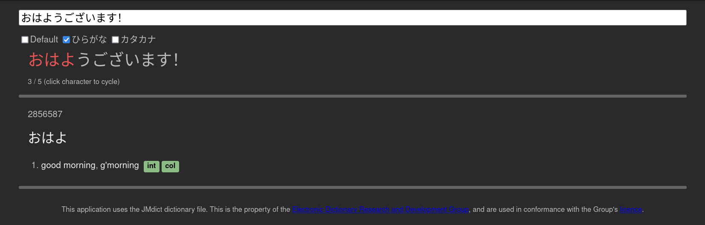
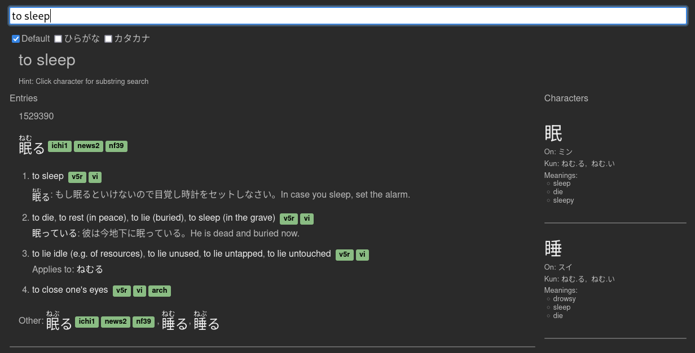
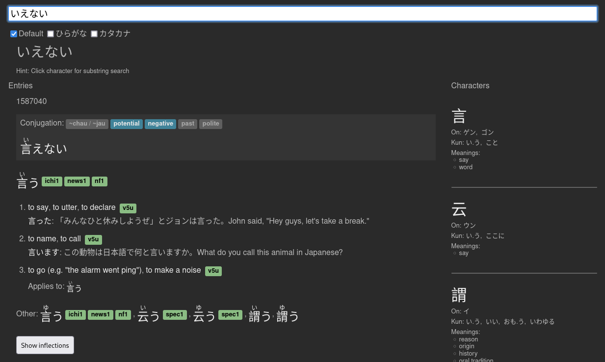
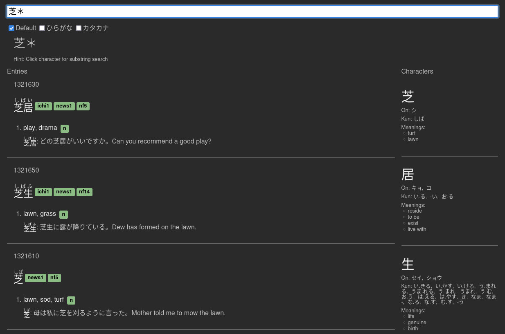
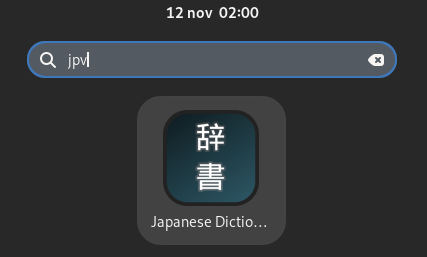

# jpv

This is my personal dictionary project.

To use, you'll have to download
- `JMdict_e_examp.gz` from <http://www.edrdg.org/wiki/index.php/Main_Page>
- `kanjidic2.xml.gz` from <http://www.edrdg.org/wiki/index.php/KANJIDIC_Project>
and place them in the root of the repository, and then run:

```sh
RUST_LOG="lib=info" cargo run --release -p tools --bin build-database
```

After that, install trunk and build the web-ui:

```sh
cargo install trunk
cargo toolchain add wasm32-unknown-unknown
trunk build --release
```

Now you can run the bundled web-ui:

```
cargo run --release -p jpv --features bundle
```



## Features

Search for English glossary or Japanese words:



Has an intuitive and unique machine conjugator:



> **Note:** Conjugations can be searched for and toggled.

Wildcard searching:



> **Note:** Currently only suffixes are support.

## Building for Fedora GNOME

To build an rpm package which is suitable for Fedora GNOME, you can do the following:

```sh
cargo build --release -p jpv --features bundle,dbus
cargo generate-rpm -p crates/jpv
```

The generated rpm will be located in `target/generate-rpm`.

```sh
sudo npm -i target/generate-rpm/jpv-0.0.0-1.x86_64.rpm
```

> **Note:** You currently have to manually copy `database.bin` to
> `/usr/share/jpv`. Including it in the rpm currently takes too
> long to build.

```sh
sudo mkdir /usr/share/jpv
sudo cp database.bin /usr/share/jpv
```

Once complete, this installs a desktop entry you can use to start the dictionary
in the background. Starting the application will open up the browser UI.


